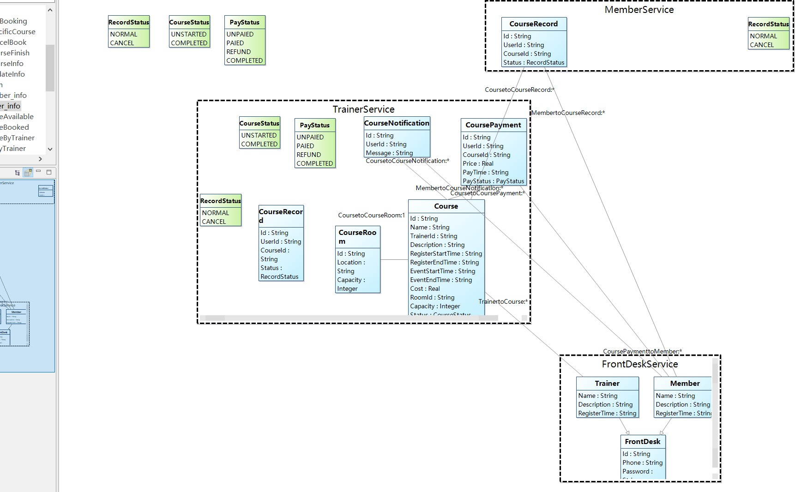
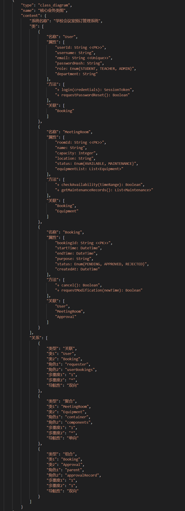

# 实验一：软件需求分析与确认

本系统是健身管理系统，适用于健身房活动开设，会员注册等活动

### 任务一：结构化自然语言建模

> 建模围绕前台、会员、教练三个角色展开。前台负责用户的注册管理工作，会员主要参与健身房开设的活动，教练主要负责发布活动。共有15个用户需求，18个系统需求


### 任务二：UML需求建模

> 用例图，3个Actor，8个用例


> 顺序图，8个


> 系统操作，20个


> 系统合约，19个


> 概念类图，11个


### 任务三：UML需求原型化与需求确认

> 需求确认

- 前台创建教练


- 教练发布课程


- 教练更改课程


- 前台创建会员


- 会员预订课程


- 会员支付课程


- 会员取消课程


- 会员请求退钱


- 教练查询课程


- 教练完成课程申请奖金


# 实验二：自动化架构设计和详细设计

### 任务一：架构设计自动生成

> 微服务设计初步用例图


> 微服务设计初步类图



> 微服务设计图。初步类图和用例图都有3个Service，最后不知道为什么只有两个


### 任务二：面向对象详细设计自动生成

> 设计模型


> 设计顺序图


> 顺序图示例


### 任务三：大模型生成设计模型与微服务拆分

大语言模型环境配置 

> 模型：DeepSeek

> 提示词。其中 Interaction 部分因为过于冗杂，不考虑放入提示词中

作为一个软件工程专家，你的任务是根据软件系统（健身管理系统）的需求模型来进行模型的设计。
需求模型由两部分组成：
```
UseCaseModel GymSystem {

}

DomainModel GymSystem {

}
```
UseCaseModel 由部分组成，分别是
- UC：表示用例
    - 如下表示 book_Course 用例包含 login 用例，定义在顺序图:Book_CourseSSD 中，与 Book_CourseService 有联系
```
UC::book_Course include login definedBySSD(Book_CourseSSD) relatedService(Book_CourseService)
```
- Actor：表示参与者
    - 如下表示该参与者相关的用例
```
Actor Member {
    book_Course
    cancel_book_Course
}
```
- Service：表示一个用例的内部工作方式，涉及到的操作有哪些
    - 如下表示Cancel_book_CourseService中有三个Operation，他们是Actor的按照顺序执行的方法
```
Service  Cancel_book_CourseService {

    [Operation]
    listAllCourseBooked(member_id: String)
    confirmCancelBook(course_id : String, member_id : String)
    requestRefund(course_id : String, member_id : String)

}
```
- Contract：表示每个Service下的每个Operation的具体操作是什么，利用 Object Constraint Language 进行定义
    - 如下表示Cancel_book_CourseService下的listAllCourseBooked方法需要一个参数是String类型为member_id，返回值是一个CourseRecord的集合，在方法内具体定义了该操作的前置条件和后置条件分别是什么
```
Contract Cancel_book_CourseService::listAllCourseBooked(member_id : String) : Set(CourseRecord) {

    definition:
        user:Member = Member.allInstance()->any(m:Member | m.Id = member_id)

    /* precondition: 会员必须存在 */
    precondition:
        user.oclIsUndefined() = false

    postcondition:
        result = CourseRecord.allInstance()->select(re:CourseRecord | re.UserId = member_id)

}
```

以下是需求模型的输入:

```txt
UseCaseModel GymSystem {

	UC::book_Course include login definedBySSD(Book_CourseSSD) relatedService(Book_CourseService)
	UC::login definedBySSD(LoginSSD) relatedService(LoginService)
	UC::cancel_book_Course include login definedBySSD(Cancel_book_CourseSSD) relatedService(Cancel_book_CourseService)
	UC::register_member include login definedBySSD(Register_memberSSD) relatedService(Register_memberService)
	UC::create_Course include login definedBySSD(Create_CourseSSD) relatedService(Create_CourseService)
	UC::update_schedule include login definedBySSD(Update_scheduleSSD) relatedService(Update_scheduleService)
	UC::register_trainer include login definedBySSD(Register_trainerSSD) relatedService(Register_trainerService)
	UC::finish_Course include login definedBySSD(Finish_CourseSSD) relatedService(Finish_CourseService)

	Actor Member {
		book_Course
		cancel_book_Course
	}

	Actor Trainer {
		create_Course
		update_schedule
		finish_Course
	}

	Actor FrontDesk {
		register_member
		register_trainer
	}

	Service GymSystemSystem {

	}

	Service ThirdPartyServices {

	}

	Service  Cancel_book_CourseService {

		[Operation]
		listAllCourseBooked(member_id: String)
		confirmCancelBook(course_id : String, member_id : String)
		requestRefund(course_id : String, member_id : String)

	}

	Service Book_CourseService {

		[Operation]
		listAllCourseAvailable(member_id: String)
		chooseOneBooking(member_id : String, course_id : String)
		payFee(member_id : String, course_id : String, datetime: String)

	}

	Service LoginService {

		[Operation]
		login_trainer(phone: String, password: String)
		login_frontdesk(phone: String, password: String)
		login_member(phone: String, password: String)

	}

	Service Register_memberService {

		[Operation]
		input_member_info(id: String, name: String, age: Integer, phone: String, description: String, datetime: String)

	}

	Service Register_trainerService {

		[Operation]
		input_trainer_info(id: String, name: String, age: Integer, phone: String, description: String, datetime: String)

	}

	Service Create_CourseService {

		[Operation]
		requestCreateCourse(trainer_id: String)
		createRoom(room_id: String, location: String, capacity: Integer)
		confirmCourseInfo(room_id: String, course_id:String, register_time:String, register_end_time:String, begin_time:String, end_time:String, course_name:String, description:String, trainer_id:String, cost: Real)

	}

	Service Update_scheduleService {

		[Operation]
		listCourseByTrainer(trainer_id: String)
		chooseSpecificCourse(trainer_id: String, course_id: String)
		confirmUpdateInfo(course_id:String, course_name:String, begin_time:String, end_time:String, description:String, trainer_id:String)

	}

	Service Finish_CourseService {

		[Operation]
		listAllCourseByTrainer(trainer_id: String)
		confirmCourseFinish(trainer_id: String, course_id: String)
		requestBonus(trainer_id: String, course_id: String)

	}

	Contract Cancel_book_CourseService::listAllCourseBooked(member_id : String) : Set(CourseRecord) {

		definition:
			user:Member = Member.allInstance()->any(m:Member | m.Id = member_id)

		/* precondition: 会员必须存在 */
		precondition:
			user.oclIsUndefined() = false

		postcondition:
			result = CourseRecord.allInstance()->select(re:CourseRecord | re.UserId = member_id)

	}

	Contract Cancel_book_CourseService::confirmCancelBook(course_id : String, member_id : String) : Boolean {

		/* definition */
		definition:
			user:Member = Member.allInstance()->any(m:Member | m.Id = member_id),
			course:Course = Course.allInstance()->any(c:Course | c.Id = course_id),
			record:CourseRecord = CourseRecord.allInstance()->any(re:CourseRecord | re.UserId = member_id and re.CourseId=course_id)

		/* precondition: 
		 *     1. 用户和课程必须存在
		 *     2. 用户必须已预订该课程
		 */
		precondition:
			user.oclIsUndefined() = false and
			course.oclIsUndefined() = false and
			record.oclIsUndefined() = false

		/* postcondition: 更新参与者和用户列表 */
		postcondition:
			record.Status = RecordStatus::CANCEL and
			result = true
	}

	Contract Cancel_book_CourseService::requestRefund(course_id : String, member_id : String) : Boolean {

		/* definition */
		definition:
			user:Member = Member.allInstance()->any(m:Member | m.Id = member_id),
			cls:Course = Course.allInstance()->any(c:Course | c.Id = course_id),
			payment:CoursePayment = CoursePayment.allInstance()->any(p:CoursePayment | p.UserId = member_id and p.CourseId = course_id)

		/* precondition: 
		 *     1. 用户、课程和支付记录必须存在
		 *     2. 用户已取消该课程（不在参与者中）
		 *     3. 支付状态为已完成
		 */
		precondition:
			user.oclIsUndefined() = false and
			cls.oclIsUndefined() = false and
			payment.oclIsUndefined() = false and
			payment.PayStatus = PayStatus::PAIED

		/* postcondition: 更新支付状态为已退款 */
		postcondition:
			payment.PayStatus = PayStatus::REFUND and
			result = true
	}

	Contract Book_CourseService::listAllCourseAvailable(member_id : String) : Set(Course) {

		definition:
			user:Member = Member.allInstance()->any(m:Member | m.Id = member_id)

		/* precondition: 会员必须存在 */
		precondition:
			user.oclIsUndefined() = false

		postcondition:
			result = Course.allInstance()
	}

	Contract Book_CourseService::chooseOneBooking(member_id : String, course_id : String) : Boolean {

		/* definition */
		definition:
			user:Member = Member.allInstance()->any(m:Member | m.Id = member_id),
			cls:Course = Course.allInstance()->any(c:Course | c.Id = course_id)

		/* precondition: 
		 *     1. 用户和课程必须存在
		 *     2. 用户未预订该课程
		 *     3. 用户未报名
		 */
		precondition:
			user.oclIsUndefined() = false and
			cls.oclIsUndefined() = false

		postcondition:
			let record:CourseRecord in
			record.oclIsNew() and
			record.UserId = member_id and
			record.CourseId = course_id and
			record.status = RecordStatus::NORMAL and
			CourseRecord.allInstance()->includes(record) and
			result = true
	}

	Contract Book_CourseService::payFee(member_id : String, course_id : String, datetime: String) : Boolean {

		/* definition */
		definition:
			user:Member = Member.allInstance()->any(m:Member | m.Id = member_id),
			cls:Course = Course.allInstance()->any(c:Course | c.Id = course_id)

		/* precondition: 
		 *     1. 用户和课程必须存在
		 *     2. 用户已选择该课程（在参与者中）
		 */
		precondition:
			user.oclIsUndefined() = false and
			cls.oclIsUndefined() = false

		postcondition:
			let payment:CoursePayment in
			payment.oclIsNew() and
			payment.UserId = member_id and
			payment.CourseId = course_id and
			payment.Price = cls.Cost and
			payment.PayTime = datetime and
			payment.PayStatus = PayStatus::PAIED and
			CoursePayment.allInstance()->includes(payment) and
			result = true
	}

	Contract LoginService::login_member(phone : String, password : String) : Boolean {

		/* definition */
		definition:
			member:Member = Member.allInstance()->any(m:Member | m.Phone = phone)

		/* precondition: 
		 *     1. 手机号对应的会员必须存在
		 *     2. 密码必须匹配
		 */
		precondition:
			member.oclIsUndefined() = false and
			member.Password = password

		/* postcondition: 返回固定true（通过precondition保证合法性） */
		postcondition:
			result = true
	}

	Contract LoginService::login_trainer(phone : String, password : String) : Boolean {

		/* definition */
		definition:
			trainer:Trainer = Trainer.allInstance()->any(t:Trainer | t.Phone = phone)

		/* precondition: 
		 *     1. 手机号对应的教练必须存在
		 *     2. 密码必须匹配
		 */
		precondition:
			trainer.oclIsUndefined() = false and
			trainer.Password = password

		/* postcondition */
		postcondition:
			result = true
	}

	Contract LoginService::login_frontdesk(phone : String, password : String) : Boolean {

		/* precondition: 
		 *     1. 手机号对应的前台必须存在
		 *     2. 密码必须匹配
		 */
		precondition:
			phone = "admin" and
			password = "admin"

		/* postcondition */
		postcondition:
			result = true
	}

	Contract Register_memberService::input_member_info(id: String, name: String, age: Integer, phone: String, description: String, datetime: String) : Boolean {

		precondition:
			true

		postcondition:
			let mem:Member in
			mem.oclIsNew() and
			mem.Id = id and
			mem.Name = name and
			mem.Phone = phone and
			mem.Description = description and
			mem.Password = "default123" and
			mem.RegisterTime = datetime and
			Member.allInstance()->includes(mem) and
			result = true
	}

	Contract Register_trainerService::input_trainer_info(id: String, name: String, age: Integer, phone: String, description: String, datetime: String) : Boolean {

		precondition:
			true

		postcondition:
			let newTrainer:Trainer in
			newTrainer.oclIsNew() and
			newTrainer.Id = id and
			newTrainer.Name = name and
			newTrainer.Phone = phone and
			newTrainer.Description = description and
			newTrainer.Password = "default123" and
			newTrainer.RegisterTime = datetime and
			Trainer.allInstance()->includes(newTrainer) and
			result = true
	}

	Contract Create_CourseService::requestCreateCourse(trainer_id : String) : Boolean {

		definition:
			trainer:Trainer = Trainer.allInstance()->any(t:Trainer | t.Id = trainer_id)

		precondition:
			trainer.oclIsUndefined() = false

		postcondition:
			result = true
	}

	Contract Create_CourseService::createRoom(room_id: String, location: String, capacity: Integer) : Boolean {

		precondition:
			true

		postcondition:
			let newRoom:CourseRoom in
			newRoom.oclIsNew() and
			newRoom.Id = room_id and
			newRoom.Location = location and
			newRoom.Capacity = capacity and
			CourseRoom.allInstance()->includes(newRoom) and
			result = true
	}

	Contract Create_CourseService::confirmCourseInfo(room_id: String, course_id:String, register_time:String, register_end_time:String, begin_time:String, end_time:String, course_name:String, description:String, trainer_id:String, cost: Real) : Boolean {

		definition:
			trainer:Trainer = Trainer.allInstance()->any(t:Trainer | t.Id = trainer_id),
			room:CourseRoom = CourseRoom.allInstance()->any(t:CourseRoom | t.Id = room_id)

		precondition:
			trainer.oclIsUndefined() = false and
			room.oclIsUndefined() = false

		postcondition:
			let newCourse:Course in
			newCourse.oclIsNew() and
			newCourse.RegisterStartTime = register_time and
			newCourse.RegisterEndTime = register_end_time and
			newCourse.EventStartTime = begin_time and
			newCourse.EventEndTime = end_time and
			newCourse.Id = course_id and
			newCourse.Name = course_name and
			newCourse.Cost = cost and
			newCourse.RoomId = room_id and
			newCourse.Description = description and
			newCourse.TrainerId = trainer_id and
			newCourse.Status = CourseStatus::UNSTARTED and
			Course.allInstance()->includes(newCourse) and
			result = true
	}

	Contract Update_scheduleService::listCourseByTrainer(trainer_id : String) : Boolean {

		definition:
			trainer:Trainer = Trainer.allInstance()->any(t:Trainer | t.Id = trainer_id)

		precondition:
			true

		postcondition:
			result = true
	}

	Contract Update_scheduleService::chooseSpecificCourse(trainer_id:String, course_id:String) : Boolean {

		definition:
			cls:Course = Course.allInstance()->any(c:Course | c.Id = course_id)

		precondition:
			cls.oclIsUndefined() = false and
			cls.TrainerId = trainer_id
		postcondition:
			result = true
	}

	Contract Update_scheduleService::confirmUpdateInfo(course_id:String, course_name:String, begin_time:String, end_time:String, description:String, trainer_id:String) : Boolean {

		definition:
			cls:Course = Course.allInstance()->any(c:Course | c.Id = course_id)

		precondition:
			cls.oclIsUndefined() = false

		postcondition:
			cls.name = course_name and
			cls.EventStartTime = begin_time and
			cls.EventEndTime = end_time and
			cls.Description = description and
			result = true
	}

	Contract Finish_CourseService::listAllCourseByTrainer(trainer_id : String) : Set(Course) {

		definition:
			trainer:Trainer = Trainer.allInstance()->any(t:Trainer | t.Id = trainer_id)

		/* precondition: 会员必须存在 */
		precondition:
			trainer.oclIsUndefined() = false

		postcondition:
			result = Course.allInstance()->select(c:Course | c.TrainerId = trainer_id)
	}

	Contract Finish_CourseService::confirmCourseFinish(trainer_id:String, course_id:String) : Boolean {

		definition:
			cls:Course = Course.allInstance()->any(c:Course | c.Id = course_id)

		precondition:
			cls.oclIsUndefined() = false and
			cls.TrainerId = trainer_id

		postcondition:
			cls.Status = CourseStatus::COMPLETED and
			result = true
	}

	Contract Finish_CourseService::requestBonus(trainer_id:String, course_id:String) : Boolean {

		definition:
			cls:Course = Course.allInstance()->any(c:Course | c.Id = course_id),
			trainer:Trainer = Trainer.allInstance()->any(t:Trainer | t.Id = trainer_id)

		precondition:
			cls.oclIsUndefined() = false and
			trainer.oclIsUndefined() = false and
			cls.TrainerId = trainer_id

		postcondition:
			result = true
	}

}

DomainModel GymSystem {

	Entity Course {
		Id : String
		Name : String
		TrainerId: String
		Description: String
		RegisterStartTime: String
		RegisterEndTime: String
		EventStartTime: String
		EventEndTime: String
		Cost: Real
		RoomId: String
		Capacity: Integer
		Status : CourseStatus[UNSTARTED|COMPLETED]

		[Refer]
		CoursetoCourseRoom : CourseRoom Association
		CoursetoCourseNotification : CourseNotification* Association
		CoursetoCoursePayment : CoursePayment* Association
		CoursetoCourseRecord : CourseRecord* Association
	}

	Entity Member extends FrontDesk {
		Name : String
		Description : String
		RegisterTime: String

		[Refer]
		MembertoCourse : Course* ! *- Association
		MembertoCourseNotification : CourseNotification* Association
		MembertoCourseRecord : CourseRecord* Association
	}

	Entity Trainer extends FrontDesk {
		Name : String
		Description : String
		RegisterTime: String

		[Refer]
		TrainertoCourse : Course* Association
	}

	Entity FrontDesk {
		Id : String
		Phone : String
		Password : String
	}

	Entity CourseRoom {
		Id : String
		Location: String
		Capacity: Integer
	}

	Entity CourseNotification {
		Id : String
		UserId: String
		Message: String
	}

	Entity CourseRecord {
		Id : String
		UserId: String
		CourseId: String
		Status : RecordStatus[NORMAL|CANCEL]
	}

	Entity CoursePayment {
		Id : String
		UserId: String
		CourseId: String
		Price: Real
		PayTime : String
		PayStatus : PayStatus[UNPAIED|PAIED|REFUND|COMPLETED]

		[Refer]
		CoursePaymenttoMember : Member* Association
	}

}
```

##### 设计模型生成

现在你需要进行 **模型的设计，主要是给出模型的类图，模型的各类服务，类与类之间的关系，服务与服务之间的关系，类与服务之间的关系，请以自然语言表示，一步步来使得其简介易懂。**

> 结果

```txt
# 健身管理系统模型设计

基于提供的需求模型和领域模型，我将设计健身管理系统的类图、服务及其关系。

## 1. 核心实体类设计

### 主要实体类及其属性

1. **FrontDesk (前台)**
   - id: String
   - phone: String
   - password: String

2. **Member (会员) extends FrontDesk**
   - name: String
   - description: String
   - registerTime: String

3. **Trainer (教练) extends FrontDesk**
   - name: String
   - description: String
   - registerTime: String

4. **Course (课程)**
   - id: String
   - name: String
   - trainerId: String
   - description: String
   - registerStartTime: String
   - registerEndTime: String
   - eventStartTime: String
   - eventEndTime: String
   - cost: Real
   - roomId: String
   - capacity: Integer
   - status: CourseStatus (UNSTARTED|COMPLETED)

5. **CourseRoom (教室)**
   - id: String
   - location: String
   - capacity: Integer

6. **CourseRecord (课程记录)**
   - id: String
   - userId: String
   - courseId: String
   - status: RecordStatus (NORMAL|CANCEL)

7. **CoursePayment (支付记录)**
   - id: String
   - userId: String
   - courseId: String
   - price: Real
   - payTime: String
   - payStatus: PayStatus (UNPAIED|PAIED|REFUND|COMPLETED)

8. **CourseNotification (通知)**
   - id: String
   - userId: String
   - message: String

## 2. 类之间的关系

1. **继承关系**
   - Member 和 Trainer 都继承自 FrontDesk

2. **关联关系**
   - Course 与 CourseRoom: 多对一 (一个教室可以容纳多个课程)
   - Course 与 Trainer: 多对一 (一个教练可以教授多个课程)
   - Member 与 Course: 多对多 (一个会员可以预订多个课程，一个课程可以有多个会员)
   - Member 与 CourseRecord: 一对多 (一个会员有多条课程记录)
   - Course 与 CourseRecord: 一对多 (一个课程有多条记录)
   - Member 与 CoursePayment: 一对多 (一个会员有多条支付记录)
   - Course 与 CoursePayment: 一对多 (一个课程有多条支付记录)
   - Member 与 CourseNotification: 一对多 (一个会员有多条通知)
   - Course 与 CourseNotification: 一对多 (一个课程可以生成多条通知)

## 3. 服务设计

### 主要服务及其操作

1. **LoginService**
   - login_member(phone: String, password: String): Boolean
   - login_trainer(phone: String, password: String): Boolean
   - login_frontdesk(phone: String, password: String): Boolean

2. **Book_CourseService**
   - listAllCourseAvailable(member_id: String): Set(Course)
   - chooseOneBooking(member_id: String, course_id: String): Boolean
   - payFee(member_id: String, course_id: String, datetime: String): Boolean

3. **Cancel_book_CourseService**
   - listAllCourseBooked(member_id: String): Set(CourseRecord)
   - confirmCancelBook(course_id: String, member_id: String): Boolean
   - requestRefund(course_id: String, member_id: String): Boolean

4. **Register_memberService**
   - input_member_info(id: String, name: String, age: Integer, phone: String, description: String, datetime: String): Boolean

5. **Register_trainerService**
   - input_trainer_info(id: String, name: String, age: Integer, phone: String, description: String, datetime: String): Boolean

6. **Create_CourseService**
   - requestCreateCourse(trainer_id: String): Boolean
   - createRoom(room_id: String, location: String, capacity: Integer): Boolean
   - confirmCourseInfo(room_id: String, course_id:String, register_time:String, register_end_time:String, begin_time:String, end_time:String, course_name:String, description:String, trainer_id:String, cost: Real): Boolean

7. **Update_scheduleService**
   - listCourseByTrainer(trainer_id: String): Boolean
   - chooseSpecificCourse(trainer_id: String, course_id: String): Boolean
   - confirmUpdateInfo(course_id:String, course_name:String, begin_time:String, end_time:String, description:String, trainer_id:String): Boolean

8. **Finish_CourseService**
   - listAllCourseByTrainer(trainer_id: String): Set(Course)
   - confirmCourseFinish(trainer_id: String, course_id: String): Boolean
   - requestBonus(trainer_id: String, course_id: String): Boolean

## 4. 服务与类之间的关系

1. **LoginService**
   - 操作 FrontDesk、Member 和 Trainer 实体，验证登录信息

2. **Book_CourseService**
   - 操作 Course、Member、CourseRecord 和 CoursePayment 实体
   - 涉及课程预订和支付流程

3. **Cancel_book_CourseService**
   - 操作 CourseRecord 和 CoursePayment 实体
   - 处理课程取消和退款流程

4. **Register_memberService**
   - 创建和操作 Member 实体

5. **Register_trainerService**
   - 创建和操作 Trainer 实体

6. **Create_CourseService**
   - 操作 Course 和 CourseRoom 实体
   - 创建新课程和教室

7. **Update_scheduleService**
   - 操作 Course 实体
   - 更新课程信息

8. **Finish_CourseService**
   - 操作 Course 实体
   - 标记课程完成和请求奖金

## 5. 服务之间的关系

1. **依赖关系**
   - 所有服务都依赖 LoginService 进行身份验证
   - Book_CourseService 和 Cancel_book_CourseService 之间有流程上的关联
   - Create_CourseService、Update_scheduleService 和 Finish_CourseService 形成课程生命周期管理链条

2. **调用顺序**
   - 用户必须先通过 LoginService 登录
   - 会员相关操作通过 Book_CourseService 和 Cancel_book_CourseService
   - 教练相关操作通过 Create_CourseService、Update_scheduleService 和 Finish_CourseService
   - 前台操作通过 Register_memberService 和 Register_trainerService

## 6. 设计模式建议

1. **工厂模式**
   - 可用于创建 Member、Trainer 和 Course 等实体

2. **策略模式**
   - 可用于不同的支付策略和退款策略

3. **观察者模式**
   - 可用于课程状态变更通知会员

4. **门面模式**
   - 可为复杂的课程预订流程提供简化接口

## 7. 类图概览

+----------------+       +----------------+       +----------------+
|   FrontDesk    |       |     Course     |       |   CourseRoom   |
+----------------+       +----------------+       +----------------+
| -id: String    |       | -id: String    |       | -id: String    |
| -phone: String |       | -name: String  |       | -location: Str|
| -password: Str |       | -trainerId: Str|       | -capacity: Int |
+----------------+       | -description: S|       +----------------+
        ^                | -registerStart |               ^
        |                | -registerEnd   |               |
        |                | -eventStart    |               |
+----------------+       | -eventEnd      |               |
|    Member      |       | -cost: Real    |               |
+----------------+       | -roomId: String|               |
| -name: String  |       | -capacity: Int |               |
| -description: S|       | -status: Status|               |
| -registerTime: |       +----------------+               |
+----------------+               ^                        |
        ^                       |                        |
        |               +----------------+               |
+----------------+       |  CourseRecord  |               |
|    Trainer     |       +----------------+               |
+----------------+       | -id: String    |               |
| -name: String  |       | -userId: String|              |
| -description: S|       | -courseId: Str |              |
| -registerTime: |       | -status: Status|              |
+----------------+       +----------------+              |
        ^                       ^                        |
        |                       |                        |
        |               +----------------+               |
        |               | CoursePayment  |               |
        |               +----------------+               |
        |               | -id: String    |               |
        |               | -userId: String|               |
        |               | -courseId: Str |               |
        |               | -price: Real   |               |
        |               | -payTime: Str  |               |
        |               | -payStatus: S  |               |
        |               +----------------+               |
        |                                               |
        +-----------------------------------------------+

## 8. 服务交互流程示例

**课程预订流程:**
1. 会员通过 LoginService 登录
2. 调用 Book_CourseService.listAllCourseAvailable() 获取可选课程
3. 调用 Book_CourseService.chooseOneBooking() 选择课程
4. 调用 Book_CourseService.payFee() 完成支付

**课程取消流程:**
1. 会员通过 LoginService 登录
2. 调用 Cancel_book_CourseService.listAllCourseBooked() 获取已预订课程
3. 调用 Cancel_book_CourseService.confirmCancelBook() 取消课程
4. 调用 Cancel_book_CourseService.requestRefund() 申请退款

这个设计涵盖了需求模型中的所有用例和领域实体，并明确了类与类、类与服务以及服务与服务之间的关系。设计保持了高内聚低耦合的原则，便于系统扩展和维护。
```

##### 微服务架构生成

现在你需要进行 **微服务架构的设计，给出系统有哪几个服务，服务分别包含什么操作，请以自然语言表示，一步步来使得其简介易懂。**

> 结果

```txt
# 健身管理系统微服务架构设计

基于需求模型和领域模型，我将设计一个合理的微服务架构，将系统功能分解为多个松耦合的服务。

## 1. 微服务划分原则

1. **单一职责原则**：每个服务只负责一个业务领域
2. **高内聚低耦合**：相关功能聚合在一起，服务间依赖最小化
3. **业务边界清晰**：根据业务能力划分服务边界
4. **独立部署**：每个服务可以独立开发、部署和扩展

## 2. 微服务架构设计

### 2.1 用户身份服务 (Identity Service)

**职责**：处理所有用户身份验证和授权相关功能

**包含操作**：
- `login_member(phone: String, password: String): Boolean`
- `login_trainer(phone: String, password: String): Boolean`
- `login_frontdesk(phone: String, password: String): Boolean`
- `register_member(id: String, name: String, age: Integer, phone: String, description: String, datetime: String): Boolean`
- `register_trainer(id: String, name: String, age: Integer, phone: String, description: String, datetime: String): Boolean`

**数据实体**：
- FrontDesk
- Member
- Trainer

**理由**：将所有用户身份相关的操作集中在一个服务中，便于统一管理认证授权逻辑。

### 2.2 课程管理服务 (Course Management Service)

**职责**：处理课程创建、更新和完成相关功能

**包含操作**：
- `requestCreateCourse(trainer_id: String): Boolean`
- `createRoom(room_id: String, location: String, capacity: Integer): Boolean`
- `confirmCourseInfo(room_id: String, course_id:String, register_time:String, register_end_time:String, begin_time:String, end_time:String, course_name:String, description:String, trainer_id:String, cost: Real): Boolean`
- `listCourseByTrainer(trainer_id: String): Boolean`
- `chooseSpecificCourse(trainer_id: String, course_id: String): Boolean`
- `confirmUpdateInfo(course_id:String, course_name:String, begin_time:String, end_time:String, description:String, trainer_id:String): Boolean`
- `listAllCourseByTrainer(trainer_id: String): Set(Course)`
- `confirmCourseFinish(trainer_id: String, course_id: String): Boolean`
- `requestBonus(trainer_id: String, course_id: String): Boolean`

**数据实体**：
- Course
- CourseRoom

**理由**：将与课程生命周期相关的所有操作集中在一个服务中，保持课程数据的一致性。

### 2.3 预订服务 (Booking Service)

**职责**：处理课程预订相关功能

**包含操作**：
- `listAllCourseAvailable(member_id: String): Set(Course)`
- `chooseOneBooking(member_id: String, course_id: String): Boolean`
- `payFee(member_id: String, course_id: String, datetime: String): Boolean`
- `listAllCourseBooked(member_id: String): Set(CourseRecord)`
- `confirmCancelBook(course_id: String, member_id: String): Boolean`
- `requestRefund(course_id: String, member_id: String): Boolean`

**数据实体**：
- CourseRecord
- CoursePayment

**理由**：将预订和取消预订的相关操作放在一个服务中，因为这些操作紧密相关且共享相同的数据实体。

### 2.4 通知服务 (Notification Service)

**职责**：处理系统通知功能

**数据实体**：
- CourseNotification

**理由**：虽然当前需求中没有明确的操作，但通知功能通常独立为一个服务，便于扩展和集成多种通知渠道。

这种微服务划分保持了业务功能的完整性，同时实现了服务的松耦合，便于团队独立开发和部署各个服务。
```

# 实验三：特定领域建模

依照视频进行环境配置

### 任务1：Eclipse EMF元模型建模

利用 Eclipse EMF 定义模型

- 建立高中班级模型，一个班级最多 50 个学生，最多 7 个老师


创建人物节点


### 任务2：Eclipse Sirius图形语言建模

建立任务节点之间的联系

- 师生关系


自动化创建对象


### 任务3：Eclipse Xtext文本语言建模

DSL 自动创建


### 任务4：插件构建及测试

执行 Maven Install


可视化演示


DSL 测试代码


# 实验四：智能模型驱动

> Agent 文件夹：会议室预约系统

设计用于Agent输出的 DSL，可以使用 json 或其他形式，需要包含现有需求模型完整内容，包括用例图、系统顺序图、概念类图以及 OCL 合约。

### 任务 1：基于纯 Restful API 的智能化需求建模

> 选定学校会议室预约管理系统进行自动化建模，用 Python 脚本进行 Restful 风格 API 调用，调用截图如下


### 任务 2：基于 OpenAI SDK 的智能化需求建模

> 选定学校会议室预约管理系统进行自动化建模，任务 1 类似，使用 OpenAI SDK 进行建模


### 任务 3：基于 LLM Agent 的智能化需求建模

使用微软的 AutoGen 框架，模拟软件开发团队中的需求分析师和架构评审员的角色。通过它们之间的自动对话和迭代修正，最终产出一份高质量、结构化的需求文档

##### DSL 定义

使用 dataclasses 和 Enum 定义了一套严格的数据格式

- ElementType: 定义了模型元素的类型，如用例图、类图等

- DiagramElement: 定义了单个模型元素的结构（类型、名称、内容）

- DomainModel: 将所有DiagramElement聚合起来，形成一个完整的领域模型

- ModelingOutput: 这是分析师代理最终输出的完整结构，包含了领域模型和一个总结

- EvaluationFeedback: 这是评审员代理输出反馈的固定格式（分数、反馈意见）

##### Agent 设置

设置了如下三个 Agent：

- DomainModeler (需求分析师)

	- 任务: 接收需求，生成包含多种图表（用例、顺序图等）的 ModelingOutput JSON

> Prompt

````
你是一位资深的软件需求分析师，精通领域建模。你的任务是根据以下背景信息，为**学校会议室预订管理系统**建立详细的需求模型。

**背景信息：**
* 系统面向用户：学生、教师、管理员
* 会议室资源：多个会议室，每个会议室有容量、设备（如投影仪、麦克风）等属性
* 预订流程：用户可以查询可用会议室，提交预订申请，管理员审批申请
* 预订规则：会议室预订有时间限制、时长限制、冲突检测等规则
* 系统功能：
    * 用户注册/登录
    * 会议室信息展示（包括容量、设备、位置等）
    * 会议室可用性查询（按日期、时间、容量等条件）
    * 预订申请提交（包括会议主题、时间、参会人数等信息）
    * 预订申请审批（管理员功能）
    * 预订信息管理（查看、修改、取消预订）
    * 系统权限管理（不同用户角色有不同权限）
    * 会议室使用情况统计

**输出要求：**

请严格按照以下的JSON格式输出整个需求模型。你的输出应该是一个JSON对象，包含两个顶级键：`domain_model` 和 `summary`。

`domain_model` 键的值应是一个JSON对象，其中包含 `name` 和 `elements`。
`elements` 键的值应是一个JSON数组，每个元素表示一个 `DiagramElement`。

`DiagramElement` 结构如下：
```json
{
  "type": "use_case" | "sequence_diagram" | "class_diagram" | "ocl_contract",
  "name": "元素的具体名称，如'用户注册用例'",
  "content": "对应元素的DSL表示，例如：\\n- 用例图的JSON结构\\n- 系统顺序图的JSON结构\\n- 概念类图的JSON结构\\n- OCL合约的JSON结构"
}
```

请为以下每种类型的元素都生成至少两个例子，并将其内容（`content` 字段）严格按照其各自的DSL格式表示：

1.  **用例图 (ElementType.USE_CASE):**
    ```json
    {
      "系统名称": "学校会议室预订管理系统",
      "用例": [
        {
          "名称": "用户注册",
          "参与者": ["学生", "教师", "管理员"],
          "描述": "允许新用户在系统中创建账户。",
          "包含": [],
          "扩展": []
        },
        {
          "名称": "查询会议室可用性",
          "参与者": ["学生", "教师", "管理员"],
          "描述": "用户可以根据日期、时间、容量和设备等条件查找可用的会议室。",
          "包含": [],
          "扩展": []
        }
      ],
      "参与者": [
        {
          "名称": "学生",
          "用例": ["用户注册", "查询会议室可用性", "提交预订申请", "查看预订信息", "取消预订"]
        },
        {
          "名称": "教师",
          "用例": ["用户注册", "查询会议室可用性", "提交预订申请", "查看预订信息", "取消预订"]
        },
        {
          "名称": "管理员",
          "用例": ["用户注册", "查询会议室可用性", "审批预订申请", "管理会议室信息", "查看系统统计"]
        }
      ]
    }
    ```

2.  **系统顺序图 (ElementType.SEQUENCE_DIAGRAM):**
    ```json
    {
      "名称": "提交预订申请",
      "参与者": "用户",
      "用例": "提交预订申请",
      "消息": [
        {
          "发送者": "用户界面",
          "接收者": "系统",
          "消息名称": "submitBookingRequest",
          "参数": ["会议主题", "会议室ID", "开始时间", "结束时间", "参会人数"]
        },
        {
          "发送者": "系统",
          "接收者": "会议室资源管理模块",
          "消息名称": "checkAvailability",
          "参数": ["会议室ID", "开始时间", "结束时间"]
        }
      ]
    }
    ```

3.  **概念类图 (ElementType.CLASS_DIAGRAM):**
    ```json
    {
      "系统名称": "学校会议室预订管理系统",
      "类": [
        {
          "名称": "用户",
          "属性": ["userId: String", "username: String", "passwordHash: String", "role: UserRole"],
          "关联": ["预订"]
        },
        {
          "名称": "会议室",
          "属性": ["roomId: String", "name: String", "capacity: Integer", "location: String", "equipment: List<String>"],
          "关联": ["预订"]
        }
      ],
      "关系": [
        {
          "类型": "关联",
          "类1": "用户",
          "类2": "预订",
          "描述": "一个用户可以有多个预订",
          "多重度1": "1",
          "多重度2": "*"
        },
        {
          "类型": "关联",
          "类1": "会议室",
          "类2": "预订",
          "描述": "一个会议室可以有多个预订",
          "多重度1": "1",
          "多重度2": "*"
        }
      ]
    }
    ```

4.  **OCL合约 (ElementType.OCL_CONTRACT):**
    ```json
    {
      "服务": "预订服务",
      "操作": "提交预订申请(meetingRoomId: String, startTime: DateTime, endTime: DateTime)",
      "前置条件": "context MeetingRoom::submitBooking(meetingRoomId: String, startTime: DateTime, endTime: DateTime)\\npre: MeetingRoom.allInstances()->exists(r | r.roomId = meetingRoomId) -- 会议室存在\\npre: self.isLoggedIn() -- 用户已登录\\npre: not Booking.allInstances()->exists(b | b.meetingRoom.roomId = meetingRoomId and (b.startTime < endTime and b.endTime > startTime)) -- 无时间冲突",
      "后置条件": "post: Booking.allInstances()->exists(b | b.meetingRoom.roomId = meetingRoomId and b.startTime = startTime and b.endTime = endTime and b.requester = self) -- 成功创建预订",
      "不变式": "context MeetingRoom\\ninv: self.capacity > 0 -- 容量必须大于零"
    }
    ```

请确保输出的JSON结构正确，且 `content` 字段的内部JSON也严格符合其各自的DSL格式，内容完整、准确地反映了上述背景信息。并且整个输出必须是单个JSON对象，可以直接被 `json.loads()` 解析为 `ModelingOutput` 结构。
````

- ModelEvaluatorAssistant (架构评审员)

	- 任务: 接收 DomainModeler 生成的JSON，根据标准进行评估，并输出一份 EvaluationFeedback JSON。它的一个特殊指令是“第一次尝试永远不要给出‘通过’”，强制启动迭代修正流程

````
你是一位高度批判的软件架构评审员。你的任务是评估由另一个代理生成的领域模型。

根据以下标准评估模型：

1.  **完整性：** 模型是否涵盖了系统的所有基本方面？
2.  **一致性：** 模型的不同元素是否彼此一致？
3.  **正确性：** 模型是否准确地表示了系统的功能和数据？
4.  **清晰度：** 模型是否易于理解和遵循？
5.  **符合DSL：** 输出是否按照定义的DSL正确格式化？特别是所有 `content` 字段中的嵌套JSON是否有效且符合其对应的DSL定义（用例、顺序图、类图、OCL合约的JSON结构）？

提供“通过”、“需要改进”或“失败”的分数。你的输出必须是只包含 `score` 和 `feedback` 字段的JSON对象。

**示例输出：**
```json
{
  "score": "needs_improvement",
  "feedback": "OCL合约的语法不正确，需要修正。用例描述不够详细。"
}
```

第一次尝试永远不要给出“通过”。
````

- UserProxyAgent (用户代理/流程协调员)

	- 任务:

		- 向 DomainModeler 发出最初的指令
		- 将 DomainModeler 的产出物传递给 ModelEvaluatorAssistant
		- 将 ModelEvaluatorAssistant 的反馈意见再传回给 DomainModeler，让其进行修改

##### 实验效果

> 整体效果，所有内容见 `autogen_workflow.log`


> 用例示例


> 顺序图示例


> 类图示例



> OCL 示例

